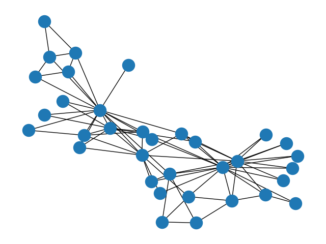

# Social networks workshop (Petnica August 2022)

Topics that will be covered:
 - graph types
 - ways of implementing graphs
 - global graph properties
 - graph traversals
 - node centrality measures
 - link prediction metricies

Repository structure:
 - `datasets/` containts three `.csv` files for each social network dataset
 - `solutions/` containts `.txt` and `.csv` files that are solutions to each task of this workshop

NOTE: `karate_club` dataset should be used for debuging and code testing 

### Karate club image

# Tasks

### **Task 01**
Load `twitch_ptbr` dataset and calculate following things:

- Total number of nodes
- Total number of edges
- Degree of each node
- Average node degree
- Graph density

### **Task 02**
How many components does `infect_dublin` graph have?

### **Task 03**
Calculate average, global and local clustering coefficient for each node in `twitch_ptbr` dataset.

### **Task 04**
Which previously calculated metric can be used to find cliques in a graph? 
Try to find some cliques larger than 3 in `twitch_ptbr` dataset.

### **Task 05**
Calculate closeness centrality for each node in `twitch_ptbr` graph.  
Who is the most central node in a graph? What's the diameter of this graph?

### **Task 06**
Find top ten nodes pairs in `twitch_ptbr` graph that have the largest number of common neighbours.

### **Task 07**
Calculate Adamic-Adar index, Jaccard coefficient and Preferential attachment metricies for each node pair in `twitch_ptbr` graph.

### **Task 08** (experminetal)
Compare link prediction metricies and determine which metric gives the best predictions and highest accuracy?

## Dataset sources
- [Karate_club](http://konect.cc/networks/ucidata-zachary/)
- [Twitch_ptbr](https://snap.stanford.edu/data/twitch-social-networks.html)
- [Infect_dublin](https://networkrepository.com/scc-infect-dublin.php)